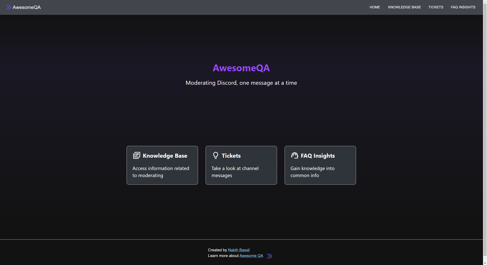
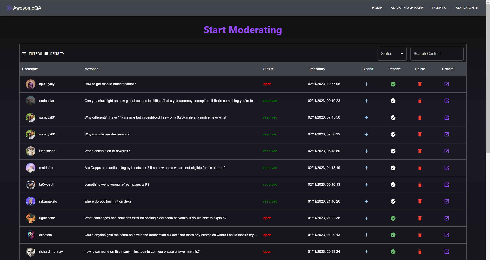
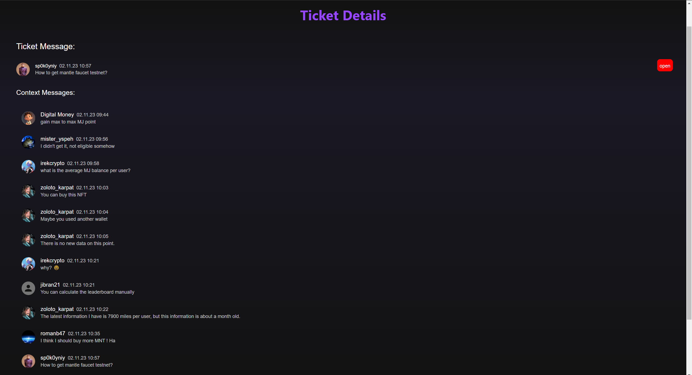

# Awesome ticket challenge

### Backend

Steps to setup the backend environment:

1. [Download the ticket data here](https://drive.google.com/file/d/1Bvk2mW5t3GfkqTkpURiFpaLuqrUckzUX/view?usp=sharing)
2. Place it in data/awesome_tickets.json
3. Run `make setup`
4. Run `make run`
5. Try it by calling [http://localhost:5001/tickets](http://localhost:5001/tickets)

### Frontend

1. Run `make setup`
2. Run `make run`
3. Open it: [http://localhost:3002](http://localhost:3002)

### Happy coding 🎉

# Results

## UI Screenshots:

    <figure style="text-align: center">
        <figcaption>Main Menu</figcaption>
        
    </figure>

    <figure style="text-align: center">
        <figcaption>Tickets Page</figcaption>
        
    </figure>

    <figure style="text-align: center">
        <figcaption>Details Page</figcaption>
        
    </figure>

## Endpoints

### Health Check

- `GET /healthz`: Returns "OK" if the API is running.

### Tickets

- `GET /tickets`: Returns a list of all tickets.
- `GET /tickets/{ticket_id}`: Returns the ticket with the specified ID.
- `DELETE /tickets/{ticket_id}`: Deletes the ticket with the specified ID and returns a message indicating the ticket was deleted.
- `PUT /tickets/{ticket_id}/resolve`: Marks the ticket with the specified ID as resolved.
- `PUT /tickets/{ticket_id}/open`: Marks the ticket with the specified ID as open.

### Messages

- `GET /messages`: Returns a list of all messages.
- `GET /messages/{message_id}`: Returns the message with the specified ID.

### Usage

To use this API, send a HTTP request to the desired endpoint. Replace `{ticket_id}` or `{message_id}` with the ID of the ticket or message you want to interact with.

For example, to get a ticket with the ID "123", send a GET request to `/tickets/123`.
